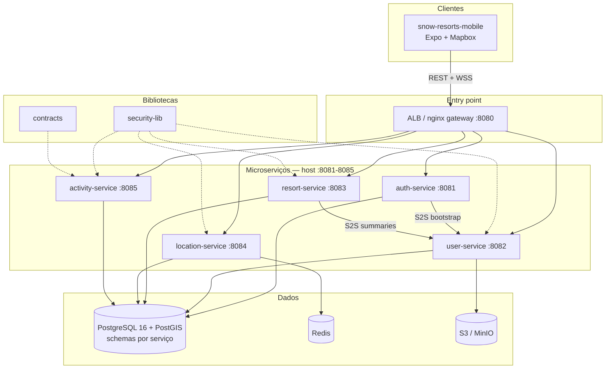
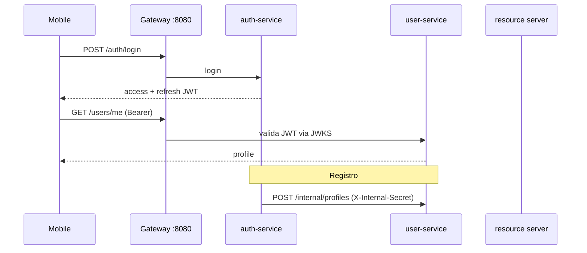

# Snow Resorts — Arquitetura

Documento de referência da arquitetura **implementada** na plataforma Snow Resorts (jul/2026).
Para subir o ambiente local, veja [LOCAL_DEV.md](./LOCAL_DEV.md). Para visão dos repositórios, veja [README.md](./README.md).

---

## Visão geral

Snow Resorts é uma plataforma de ski tracking e social para resorts de neve. A solução é um **polyrepo** de 8 repositórios Git independentes sob este workspace:

| Repositório | Papel |
|-------------|-------|
| `snow-resorts-shared` | Bibliotecas Java publicadas (GitHub Packages) |
| `snow-resorts-auth-service` | Autenticação JWT |
| `snow-resorts-user-service` | Perfis, avatares, amizades, presença |
| `snow-resorts-resort-service` | Catálogo de resorts, geometria PostGIS, reviews |
| `snow-resorts-location-service` | Grupos ao vivo, posição de amigos, WebSocket |
| `snow-resorts-activity-service` | Descidas (runs), métricas, leaderboard |
| `snow-resorts-infra` | Docker local, Terraform AWS, seed |
| `snow-resorts-mobile` | App Expo (iOS/Android) |

**Stack backend:** Java 25, Spring Boot 3.5.6, PostgreSQL 16 + PostGIS, Redis, S3/MinIO.

**Stack mobile:** Expo SDK 56, React Native 0.85, Mapbox GL, STOMP/WebSocket, TanStack Query, Zustand.

---

## Diagrama do sistema

---

## Entry point e roteamento

Um único origin expõe toda a API — localmente via **nginx** (`:8080`), em produção via **ALB** com path routing (sem API Gateway no MVP).

| Path | Serviço | Porta local |
|------|---------|-------------|
| `/snow-resort-service/v1/auth/*` | auth-service | 8081 |
| `/snow-resort-service/v1/users/*` | user-service | 8082 |
| `/snow-resort-service/v1/friends/*` | user-service | 8082 |
| `/snow-resort-service/v1/resorts/*` | resort-service | 8083 |
| `/snow-resort-service/v1/location/*` | location-service | 8084 |
| `/ws/*` | location-service (WebSocket STOMP) | 8084 |
| `/snow-resort-service/v1/runs/*` | activity-service | 8085 |
| `/snow-resort-service/v1/leaderboard/*` | activity-service | 8085 |
| `/.well-known/jwks.json` | auth-service | 8081 |
| `/swagger/` | Swagger UI unificado (só local) | 8080 |

O mobile usa `http://localhost:8080/snow-resort-service/v1` (REST) e `ws://localhost:8080/ws` (STOMP em `/ws/location`).

---

## Microserviços

### auth-service (`:8081`)

Emite e renova tokens; **não** atua como resource server.

| Endpoint | Descrição |
|----------|-----------|
| `POST /auth/register` | Registro (email, senha, username, displayName) → bootstrap de perfil no user-service |
| `POST /auth/login` | Login → access + refresh token |
| `POST /auth/refresh` | Rotação single-use do refresh token (reuse detection) |
| `POST /auth/logout` | Revoga refresh token |
| `POST /auth/forgot-password` | Envia e-mail de reset (Mailpit local) |
| `POST /auth/reset-password` | Redefine senha com token opaco |
| `GET /.well-known/jwks.json` | Chave pública RS256 para os demais serviços |

**Auth:** RS256, access token 15 min (`sub` = UUID do usuário), refresh opaco 30 dias (hash SHA-256 no Postgres).

### user-service (`:8082`)

Perfis, avatares, amizades e presença.

| Endpoint | Descrição |
|----------|-----------|
| `GET/PUT /users/me` | Perfil do usuário autenticado |
| `GET /users/{id}` | Perfil público |
| `POST /users/me/avatar/upload-url` | URL pré-assinada (MinIO/S3) |
| `PUT /users/me/avatar/confirm` | Confirma upload do avatar |
| `DELETE /users/me/avatar` | Remove avatar |
| `PUT /users/me/presence` | Heartbeat de presença (janela online: 5 min) |
| `GET /friends` | Lista de amigos |
| `POST /friends/requests` | Pedido por username |
| `GET /friends/requests/incoming` | Pedidos recebidos |
| `POST /friends/requests/{id}/accept\|reject` | Aceitar/rejeitar |
| `DELETE /friends/{id}` | Remover amigo |

**APIs internas** (header `X-Internal-Secret`, não expostas ao mobile):

- `GET /users/internal/usernames/{username}/available`
- `POST /users/internal/profiles` — bootstrap no registro
- `POST /users/internal/profiles/summaries` — nomes de autores de reviews

**Privacidade:** `shareStats` e `shareLocation` por perfil.

### resort-service (`:8083`)

Catálogo, geometria espacial e reviews.

| Endpoint | Descrição |
|----------|-----------|
| `GET /resorts` | Lista paginada (`country`, `q`, `near=lat,lng`, `radiusM`) |
| `GET /resorts/{id}` | Detalhe do resort |
| `GET /resorts/{id}/nearby-geometry` | Pistas e lifts num raio (default 100 km, máx. 200 km) — PostGIS `ST_DWithin` |
| `GET /resorts/{resortId}/reviews` | Reviews públicas |
| `GET /resorts/{resortId}/reviews/me` | Review do usuário autenticado |
| `POST/PUT/DELETE .../reviews` | CRUD de review (autenticado, ownership) |

**PostGIS:** tabelas `trails` e `lifts` com `geometry(LineString, 4326)` e índices GIST. Seeds incluem catálogo mundial + geometria OSM (V6).

**Segurança HTTP:** leitura do catálogo é `permitAll`; mutações usam JWT no controller.

### location-service (`:8084`)

Grupos ao vivo e compartilhamento de posição entre amigos.

| Endpoint | Descrição |
|----------|-----------|
| `POST /location/groups` | Cria grupo (código de convite) |
| `POST /location/groups/{inviteCode}/join` | Entra no grupo |
| `GET /location/groups/{id}` | Detalhe + membros |
| `GET /location/groups/{id}/positions` | Snapshot das posições atuais |
| `POST /location/groups/{id}/position` | Fallback REST (rate limit ~12/min) |

**WebSocket STOMP** (`/ws/location`):

- Publicar: `/app/groups/{groupId}/position`
- Assinar: `/topic/groups/{groupId}`
- JWT no `CONNECT`; membership validada antes de subscribe

**Redis:** HASH `location:group:{groupId}` (TTL 24h) + Pub/Sub para fanout entre instâncias → STOMP.

### activity-service (`:8085`)

Tracking de descidas e leaderboard entre amigos.

| Endpoint | Descrição |
|----------|-----------|
| `POST /runs/start` | Inicia run (`resortId`, `trailId` opcional) |
| `PATCH /runs/{id}/points` | Batch de pontos GPS (`Idempotency-Key` opcional) |
| `POST /runs/{id}/finish` | Finaliza e calcula métricas |
| `GET /runs` | Histórico paginado |
| `GET /runs/{id}` | Detalhe + métricas |
| `GET /runs/{id}/replay` | GeoJSON para replay no mapa |
| `DELETE /runs/{id}` | Remove run |
| `GET /leaderboard/friends` | Ranking (`period=today\|week\|season`, `friendIds` do client) |

Pontos GPS ficam em Postgres (`activity.gps_points`). Idempotência em memória (MVP).

---

## snow-resorts-shared

| Módulo | Artifact | O que entrega |
|--------|----------|---------------|
| `security-lib` | `com.snowresorts:security-lib` | Resource server JWT, `SecurityUtils`, RFC 7807, headers OWASP, `X-Trace-Id`, Jackson de datas |
| `contracts` | `com.snowresorts:contracts` | `RunCompletedEvent` + stub OpenAPI agregado |

Publicação: tag `v*.*.*` → GitHub Actions → GitHub Packages. Serviços consomem via `pom.xml` (não via pasta irmã).

---

## snow-resorts-mobile

**Não roda no Expo Go** — usa dev client (`expo-dev-client`), Mapbox, MMKV e New Architecture.

### Abas e rotas principais

| Aba | Rotas | Função |
|-----|-------|--------|
| Mapa | `map/`, `map/descent`, `map/resort/[id]`, `map/friend/[id]`, `map/select-resort` | Mapa Mapbox, descida ativa, geometria PostGIS, amigos no mapa |
| Runs | `runs/`, `runs/[id]` | Histórico e replay de descidas |
| Resorts | `resorts/`, `resorts/[id]` | Catálogo e detalhe com reviews |
| Amigos | `friends/`, `friends/[id]`, `friends/group/[id]` | Amizades e grupos ao vivo |
| Perfil | `profile` | Perfil, avatar, configurações de privacidade |
| Auth | `login`, `register`, `forgot-password`, `reset-password` | Fluxo JWT + deep link `snowresorts://` |

### Integração com backend

- REST via `axios` + refresh automático em 401 (`src/api/client.ts`)
- STOMP singleton para posição ao vivo (`src/lib/locationStompClient.ts`)
- Fila offline para pontos GPS durante descida (`expo-sqlite`)
- Mapbox offline packs para tiles sem rede
- Mock GPS opcional (`EXPO_PUBLIC_MOCK_LOCATION`, script `setup-mock-gps.sh`)

---

## Dados

### Banco — um Postgres, schema por serviço

Database `snow_resorts`, extensões `postgis`, `uuid-ossp`, `pgcrypto`. Cada serviço roda Flyway no seu schema — **sem JOIN cross-schema**.

| Schema | Tabelas principais |
|--------|-------------------|
| `auth` | `users_auth`, `refresh_tokens`, `password_reset_tokens` |
| `users` | `profiles`, `friendships`, `push_tokens`*, `user_presence` |
| `resorts` | `resorts`, `trails`, `lifts`, `resort_reviews` |
| `location` | `groups`, `group_members` |
| `activity` | `runs`, `run_metrics`, `gps_points` |

\* `push_tokens` existe no schema, mas **sem API implementada** ainda.

**PostGIS:** tipos/funções em `public`; conexões do resort-service usam `search_path=resorts,public` (via JDBC `options` + `connection-init-sql`).

### Redis (location-service)

| Chave / canal | Uso |
|---------------|-----|
| `location:group:{groupId}` | Posições ao vivo (HASH, TTL 24h) |
| `location.group.{groupId}` | Pub/Sub para fanout multi-instância |
| `avatar:{userId}` | Cache read-only de URL de avatar |

### Object storage (MinIO local / S3 AWS)

| Bucket | Uso atual |
|--------|-----------|
| `snow-resorts-assets` | Avatares (`avatars/{userId}/current.webp`) |
| `snow-resorts-tracks` | Provisionado (Terraform); **não usado** — pontos GPS ficam no Postgres |

Tabelas removidas: `run_tracks_s3` (activity V3), `resort_map_packages` (resort V8). Mapas offline são responsabilidade do mobile (Mapbox).

---

## Autenticação e comunicação entre serviços

- **JWT RS256** validado por todos os resource servers via `jwk-set-uri` (auth-service).
- **Refresh:** rotação single-use; reuso de token revogado invalida a família.
- **S2S:** `X-Internal-Secret` (local: `dev-internal-secret`) para auth→user e resort→user.

---

## Infraestrutura

### Local (`snow-resorts-infra`, `make dev`)

| Container | Porta | Função |
|-----------|-------|--------|
| postgres (PostGIS 16) | 5432 ou 5433 | DB `snow_resorts` |
| redis | 6379 | Location fanout |
| minio | 9000/9001 | S3 local |
| mailpit | 1025/8025 | SMTP + UI de e-mails |
| nginx | 8080 | Gateway + redirect `/reset-password` |
| swagger-ui | (interno) | `/swagger/` unificado |

Microserviços rodam **no host** (`./mvnw spring-boot:run`), não no Docker.

Demo: `demo@snow-resorts.com` / `Password123!` (seed via `make dev`).

### AWS (Terraform)

Módulos: `vpc`, `rds`, `ecs`, `alb`, `redis`, `s3-cloudfront`, `waf`.

| Ambiente | Forma | Custo estimado |
|----------|-------|----------------|
| **staging** | 1 task Fargate consolidada (5 serviços), sem Redis, subnets públicas | ~$42–55/mês |
| **prod** | 5 tasks Fargate separadas, ElastiCache Redis, NAT, WAF, RDS Multi-AZ | ~$120–200/mês |

Swagger na AWS: documentado no Terraform, **não provisionado** ainda (comentado nos `routing_rules`).

---

## CI/CD

| Repo | Trigger | Pipeline |
|------|---------|----------|
| `snow-resorts-shared` | tag `v*.*.*` | build + publish → GitHub Packages |
| 5 serviços Java | PR/push `master` | `mvn verify` (Testcontainers) → Docker → ECR → ECS |
| `snow-resorts-infra` | push `terraform/**` | `fmt` + `validate`; apply manual |
| `snow-resorts-mobile` | PR/push `master` | `tsc --noEmit`; EAS build manual (`EXPO_TOKEN`) |

---

## Implementado vs. roadmap

### ✅ Implementado e em uso

- Auth completo (registro, login, refresh, reset de senha, JWKS)
- Perfis, avatares (S3), amizades, presença
- Catálogo de resorts com geometria PostGIS e reviews
- Grupos ao vivo + posição em tempo real (Redis + STOMP)
- Tracking de descidas, métricas, replay, leaderboard entre amigos
- App mobile end-to-end contra gateway local
- Infra Docker local + módulos Terraform staging/prod
- Swagger unificado local

### 🚧 Schema ou lib existe, app ainda não usa

| Item | Estado |
|------|--------|
| `users.push_tokens` | Tabela Flyway V3, sem controller |
| `RunCompletedEvent` (`contracts`) | Definido, não publicado pelo activity-service |
| OpenAPI agregado (`contracts`) | Stub; mobile usa `endpoints.ts` manual |
| Leaderboard cache Redis | Comentado no código, query direta no Postgres |
| Avatar cache Redis writer | `AvatarCache` é read-only |
| Idempotency store | In-memory; comentário sugere Redis/DB em prod |
| SNS/SQS eventos | Nas regras `.cursor`, não no código dos serviços |
| TimescaleDB hypertable | Nota na migration; tabela Postgres simples |
| Swagger na AWS | Terraform comentado |
| `GET /location/groups` (listar meus grupos) | Mobile guarda grupos localmente |

### Decisões registradas

Ver [ADR 0001 — Backend foundation](snow-resorts-shared/docs/adr/0001-backend-foundation.md) para decisões de fundação (Java 25, sem Lombok, schema-per-service, JWT RS256, ports & adapters).

---

## Referências rápidas

| Item | Valor |
|------|-------|
| API local | `http://localhost:8080/snow-resort-service/v1` |
| WebSocket local | `ws://localhost:8080/ws/location` |
| Swagger local | `http://localhost:8080/swagger/` |
| Mailpit UI | `http://localhost:8025` |
| MinIO console | `http://localhost:9001` |
| Metro (mobile) | `:8086` |
| Correlation ID | header `X-Trace-Id` |
