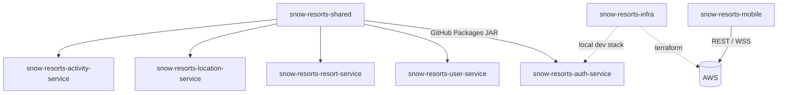

# Snow Resorts — polyrepo workspace

This folder is a **workspace container** holding the independent repositories that make up
the Snow Resorts platform. Each subfolder is a standalone Git repository with its own
`pom.xml`/`package.json`, CI/CD workflow and release lifecycle. They are **not** a monorepo.

**Architecture reference (current implementation):** [ARCHITECTURE.md](./ARCHITECTURE.md)

## Repositories

| Folder | GitHub repo (`yurileao`) | What it is | CI/CD |
|--------|--------------------------|------------|-------|
| `snow-resorts-shared` | `snow-resorts-shared` | Publishable libs (`security-lib`, `contracts`) | Publishes JARs to GitHub Packages on tag `v*` |
| `snow-resorts-auth-service` | `snow-resorts-auth-service` | auth-service (:8081) | Build/test → ECR → Fargate |
| `snow-resorts-user-service` | `snow-resorts-user-service` | user-service (:8082, avatars) | Build/test → ECR → Fargate |
| `snow-resorts-resort-service` | `snow-resorts-resort-service` | resort-service (:8083, PostGIS, reviews) | Build/test → ECR → Fargate |
| `snow-resorts-location-service` | `snow-resorts-location-service` | location-service (:8084, WebSocket) | Build/test → ECR → Fargate |
| `snow-resorts-activity-service` | `snow-resorts-activity-service` | activity-service (:8085, descents) | Build/test → ECR → Fargate |
| `snow-resorts-infra` | `snow-resorts-infra` | Terraform + local Docker dev | Terraform validate/apply |
| `snow-resorts-mobile` | `snow-resorts-mobile` | Expo app | tsc + EAS |

## Dependency flow



The 5 services depend on `com.snowresorts:security-lib` (and activity also on `contracts`),
pulled from **GitHub Packages** — not from a sibling folder. Bump
`snow-resorts-shared.version` in a service `pom.xml` to adopt a new shared release.

## One-time setup per repo

```bash
# From each subfolder, create the GitHub repo and push:
cd snow-resorts-shared
git init && git add . && git commit -m "Initial commit"
gh repo create yurileao/snow-resorts-shared --private --source=. --push
```

Repeat for every folder. Order matters once: tag & publish `snow-resorts-shared`
(`git tag v1.0.0 && git push origin v1.0.0`) **before** the services' CI can resolve the libs.

## Credentials

- **GitHub Packages:** each Java repo needs a `github` server in `~/.m2/settings.xml` with a
  PAT (`read:packages`; `write:packages` to publish). See each repo's `settings.xml.example`.
- **AWS deploy:** service repos need the `AWS_DEPLOY_ROLE_ARN` secret; infra needs
  `AWS_TERRAFORM_ROLE_ARN`; mobile needs `EXPO_TOKEN`.

## Local development ($0)

**Guia completo passo a passo:** [LOCAL_DEV.md](./LOCAL_DEV.md) (infra, microserviços, simulador iOS, troubleshooting).

```bash
cd snow-resorts-shared && ./mvnw install        # publish libs to local ~/.m2
cd ../snow-resorts-infra && make dev            # Postgres+PostGIS, Redis, MinIO, Mailpit, nginx (:8080) + seed
cd ../snow-resorts-auth-service && ./mvnw spring-boot:run
# ...repeat for the other services (auth :8081, user :8082, resort :8083, location :8084, activity :8085)
```

The `make dev` stack includes an **nginx gateway on :8080** that mirrors the prod ALB
path routing. The services run on the host (ports 8081-8085) and the gateway proxies
the new path prefix to them, so the mobile app talks to a single origin:
`http://localhost:8080/snow-resort-service/v1` (and `ws://localhost:8080/ws` for WebSocket).

### API docs — one Swagger UI for all services

The gateway also serves a **single unified Swagger UI** for the whole platform:

```
http://localhost:8080/swagger/
```

Pick a service from the dropdown (auth, user, resort, location, activity) to browse its
live OpenAPI contract. Each spec is the service's own springdoc `/v3/api-docs`, proxied
same-origin through the gateway at `/api-docs/<service>`. "Try it out" routes back through
the gateway, so start the services first.
